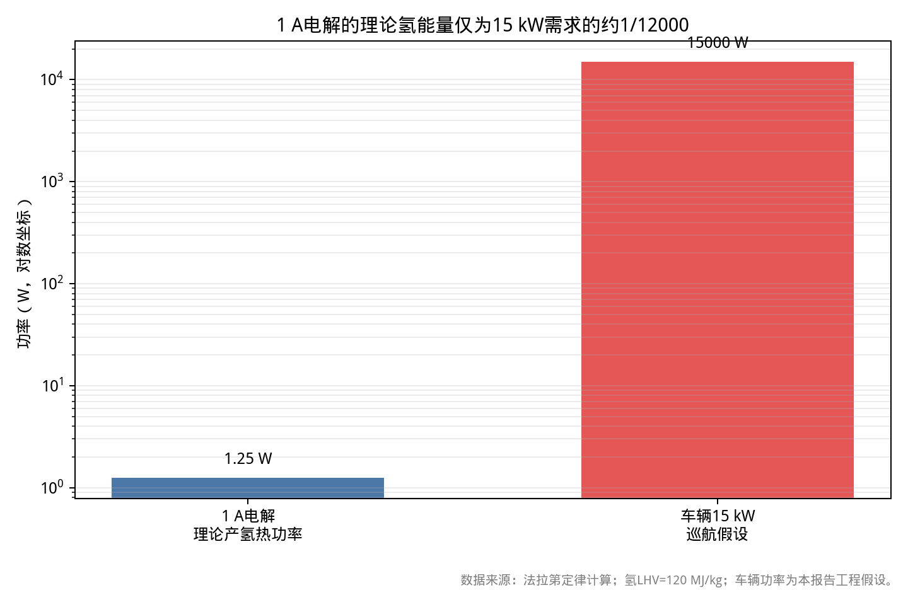
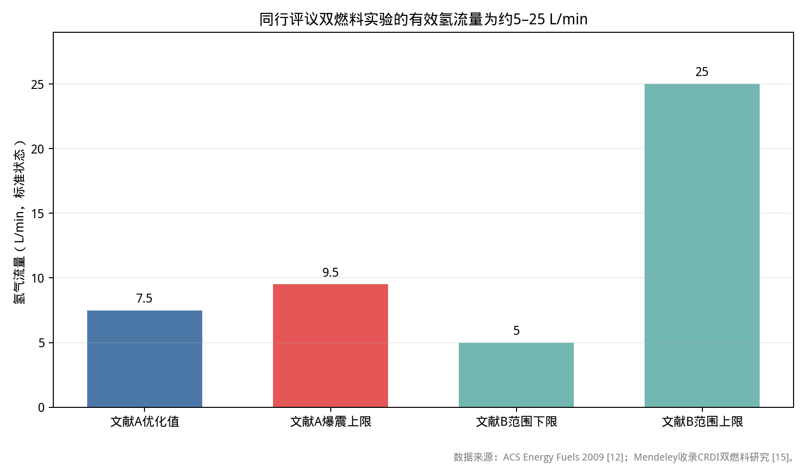

# Joe Cell 技术装车运行可行性论证：面向柴油机 Fumigation 实践

> **📌 编者校核提示（2026-09-11，仅此一段为编者所加，正文一字未改）**
> 本报告的**核心量级论证已复算通过**（1 A → 6.96 mL/min、1.25 W；泵气功 202.65 J/次、3,378 W 均正确）。
> 但 **§3.2 表格有三处数字不自洽**（"0.45 g/s / 1.62 kg/h / 18.1 L/min"——按 LHV 120 MJ/kg 重算应为 **0.125 g/s ≈ 0.45 kg/h ≈ 83 L/min**，对应"约 1.2 万倍"而非"2,600 倍"）；另有个别单位笔误与占位/噪声引注（[6][10]；原 [15]–[20] 噪声链接已按指示删除）。
> **全部细节见 [`06_编者校核与后续清单.md`](06_编者校核与后续清单.md)**。修好后**主结论不变、差距反而更大**。

## 摘要：常规电解与原子氢机制不足以驱动车辆，可控掺氢路线具备有限工程价值

本报告的核心结论是：**Joe Cell 不能构成“车载电解水、零燃料行驶、负压做功”的能量源；但“自然吸气柴油机＋进气道氢气 fumigation＋柴油引燃”路线具有真实的工程研究价值。**两条命题必须分开判断。前者违反能量守恒、法拉第电解定律、气体动力学与燃烧化学；后者已有同行评议基础，只是效果规模、安全边界和供氢条件与 Joe Cell 原始主张并不相容。

按 12 V／1 A、法拉第效率 100% 估算，水电解每小时最多生成约 **0.419 L（STP）H₂**，对应热功率仅约 **1.25 W**；即使按“HHO”计，化学能仍不超过数瓦量级。该数量级相对于车辆 10–20 kW 行驶功率存在约 **10⁴ 倍缺口**，足以在单一守恒框架内否决“电解供能驱动车辆”的命题。即使电解效率下降、电流测量偏差或氢氧混合使实际产气量发生变化，数量级也不会因此跃升。约束结果的根本变量是电荷量，而不是 Joe Cell 的结构、水质或“充电”方式。

原子氢也不构成可行的中间储能机制。水电解的电极反应直接生成 H₂ 与 O₂；H 原子在常温液相或气相中会迅速复合，不可能长期积累至燃料级浓度。其复合热至多是先吸收电解能、再回收部分化学能的回授过程，不能凭空放大输入电功率。

气缸内“以负压吸收大气压能推动活塞”的解释同样不成立。四 冲程发动机的正常做功路径是燃烧升压，随后依靠气体膨胀推动活塞；即使存在瞬时压力下降，其可用功也远低于压缩燃烧路径。计入进气节流和泵气损失后，更不能把大气压力视为额外的无限能源。

圈内“提前约 80°”的说法具有明确的原始文本依据，但现有证据只能证明发生过改装和正时调整，不能证明车辆在无燃料、无能量输入的情况下运行。Rover V8 案例来自 Hilton 对 Joe 的转述；若进气系统存在未计量空气，实际燃烧可能变慢，正时调整也可能属于标定补偿。这与“H₂ 提高火焰传播速度因而必须大幅提前”的解释并不等价。[2][3]

同行评议的 H₂–柴油双燃料研究表明，有效氢气流量为 **2–25 L/min** 量级，优化区间约为 **7.5–15 L/min**；而 Joe Cell 在 1 A 下的理论产氢量约为 **0.007 L/min**，两者相差约 **10³–10⁴ 倍**。[5][6][10] 因此，采用**外部氢气瓶、质量流量控制器和止回/阻火系统**进行对照实验，是验证掺氢燃烧效应的合理起点；依靠车载 Joe Cell 实时供氢，则不具备基本的数量级基础。

诚实的工程落地路径应是：**保留柴油引燃，控制 H₂ 能量替代率，使用缸压、空燃比、NOx、烟度、油耗和爆震判据进行标定。** 真实可复现效果通常限于燃烧加速、烟度降低和热效率小幅改善；零燃料行驶、水不被消耗、输出超过输入，以及由 H₂/O₂ 燃烧形成净负压驱动，均应列为不可接受或已被否决的命题。

## 1. 原始主张与工程命题必须拆分，证据强度决定结论边界

**Joe Cell 可以作为电解器和气体发生装置进行研究，但不能因此接受其“零燃料、负压做功、原子氢驱动”的完整解释链。** 本报告将原始文本中的物理描述与可测量的工程命题逐一拆开；前者只用于忠实还原主张，后者才接受计算、实验和证伪检验。

“圈内解释”仅引用 Alex Schiffer、Barry Hilton、moe-joe-working.com 及复制材料，用于忠实还原主张，不预设其成立，也不因其表述非常规而直接否定。**【证据强度：仅有圈内文本、爱好者论坛或轶事；以下记为“圈内”】**

“主流解释”采用法拉第电解定律、热力学、电化学、燃烧化学和发动机原理，并优先采用同行评议或权威机构资料。**【证据强度：同行评议／权威机构文献；以下记为“主流”】** 部分 Joe Cell 结构细节存在不同转录版本，本报告只采纳能够明确追溯至原始文本的参数，并在证据不足时保留口径限制。

### 1.1 研究对象必须收缩为可测的 H₂–柴油双燃料系统

用户提出的机制链可拆为六个独立命题：

1. 316L 同心筒、水和 12 V／1 A 电解会产生显著数量的“单质氢”；
2. 断电后持续存在的气泡、自发电势和脉动属于“原子氢持续生成或繁殖”的证据；
3. H₂/O₂ 在气缸中先发生“内爆”，利用负压吸收大气压能；
4. 因此自然吸气柴油机只需保留压燃，并显著调整正时；
5. 进气道 fumigation 的少量 H₂ 能够替代大部分柴油；
6. 车载电解可供氢，盲塞端的 4 英寸无喉箍橡胶套可作为泄压与能量传递装置。

第 1、5、6 项可以测量，第 2、3、4 项则必须先转化为可证伪命题，不能以“现象无法解释”替代因果证明。

本报告建议采用统一的保守底盘：**自然吸气四冲程柴油机，排量 2.0 L，怠速 800 r/min，巡航 2,000 r/min，正常行驶 15 kW（介于 10–20 kW 之间），进气为常压 1 atm。** 这些参数只用于量级估算，并非任何实机的标称数据。涉及不同排量、增压系统、负荷和转速时，必须重新计算，不能直接沿用百分比结论。

### 1.2 证据口径决定哪些结论可以外推

圈内证据至少包含三类问题：

- 文本转录不一致；
- 传闻、复述与实机记录混用；
- 里程、温度和排放等结果缺少同时期质量平衡、缸压、油耗或第三方复现。

因此，Hilton 文本可以用于确认“有人声称做了什么”，但不能单独证明车辆在无燃料情况下完成行驶。Rover V8 的“80°”提前尤其只能作为改装现象记录，不能视为适用于其他发动机、其他燃料和其他进气系统的通用标定参数。

相反，同行评议研究也存在排量、负荷、喷射方式、燃料性质和台架条件差异。本报告只采用其明确公布的有效氢流量、效率、NOx、烟度和爆震边界，不外推为任意柴油机均可实现的具体百分比。

## 2. Mark III 结构可以复现，但无法推出特殊氢物种或超常规能量

**圈内对 Mark I–III 的材料、尺寸和接口描述具有内部一致性；主流解释则确认，电解、气泡、原电池电势与脉动均不要求“原子氢”或零输入能量假设。** 因而，Joe Cell 可以作为一个特定结构的电解器加以研究，却不能因为外观和气泡现象特殊，就推定其产物或能量机制超越常规电化学。

|命题|圈内解释|主流解释与计算|裁决|
|---|---|---|---|
|同心筒电解|Mark III：四只不锈钢同心筒；中心阴极 1 英寸、三只“中性”筒分别为 2、3、4 英寸，外壳为阳极；使用“charged water”，19 mm 铝管连接到化油器，末端采用 4 英寸优质橡胶软管，不装卡箍或密封剂；电流约 200 mA–1 A，24–50 V 用于活化。[2][3]|316L 浸水后会建立液接、电极极化和表面氧化层；多筒构成多个电解室或电容器式网络，但仍服从电荷守恒。原子氢产量、特殊爆鸣性质或“breeding”没有获得独立化学分析支持。|结构描述：**部分成立（圈内）**；其超常规解释：**不成立**|
|气泡分级|Stage 1：断电后气泡迅速消失；Stage 2：断电后持续数分钟，液面和表面张力变化；Stage 3：断电 24 小时后仍残留气泡和表面张力，并称其为“breeding cell”。[1]|微泡、表面活性剂、胶体、金属腐蚀颗粒和润湿性变化均可延长气泡寿命；气含率、气泡粒径和液相流变学可以测量。断电后残泡不等于持续产气。|现象可能成立；将残泡解释为原子氢繁殖：**不成立**|
|“充电”后自发电势|圈内称断电 24 小时后约有 1 V 电势，并据此认为水体保持“活性”。[1][3]|不同金属、氧化物、氧化还原物种和浓差可形成原电池或开路电势；浓度为 nmol/L 级的离子也不会改变法拉第电荷计量。该现象不需要零输入能量解释。|自发电势：**部分成立（主流）**；“繁殖”能量：**不成立**|
|脉动与旋转前沿|圈内报告约 2 次/秒脉动和约 2 秒/圈旋转前沿，并将视觉模式解释为旋转场或 orgone。[1]|电极气体释放、对流、气泡共振、电磁驱动流、低频电源纹波和热对流均可能产生可视脉动。必须进行粒子图像测速（PIV）、压力传感器或高速摄像，才能判断“旋转前沿”是否具有真实流体结构。|现象未独立复现；物理解释：**不成立**|

### 2.1 Mark III 的尺寸参数不能直接视为唯一规范

Hilton 原始材料称，Joe 的初始电池为约 4 英寸直径、3 英尺长不锈钢管，内部穿孔元件约 3.5 英寸直径、2 英尺长；后来将车辆用单元缩短至约 18 英寸，即约 435 mm。[2]

Mark III 的描述为中心 1 英寸直径阴极、2/3/4 英寸“中性”筒，外壳作为阳极。Schiffer 转录材料称，中央筒直径为 1 英寸、高度为 8 英寸；三只中性筒高度与阴极相同，外壳厚 3 mm。[2][3] 该描述可用于搭建物理装置，但不能据此推出 Joe Cell 是“电容器—电解器—特殊氢源”的复合设备。

### 2.2 现有文本不足以重建唯一“1 A @ 12 V”操作规程

不同材料对电压和电流的说明并不完全一致：Hilton 材料提到 12 V 电池和短时预充电；Nutech 邮件转录则建议使用约 200 mA–1 A、24–50 V 进行活化。[2][3] 两者不能在缺少电路拓扑和实测电流的条件下合并为唯一工况。

不同电解小室的电流分配、有效电极面积、极化电阻和法拉第效率，也会随电解液、污染程度和接线方式变化。因此，报告仅使用“1 A 总输入”作为最大可解释产氢量计算点，不假设 1 A 全部流经产氢活性面积，也不假定产气效率为 100%。这两个保守处理只会高估 Joe Cell 的供氢能力，不会削弱数量级否决结论。

## 3. 1 A 电解只能提供数瓦级化学能，无法跨入车辆功率需求

**12 V／1 A 输入的电荷量决定了 Joe Cell 的理论产氢上限，而该上限仅约 1.25 W 热功率。** 即使忽略全部电解损耗，结果仍比 15 kW 车辆功率小约四个数量级；任何“结构激活”“水质充电”或“零输入”解释都不能绕过这一电荷约束。

### 3.1 理论产氢量可由法拉第定律直接计算

在 25 °C、1 atm 下，按理想气体处理，取标准摩尔体积 22.414 L/mol；若采用 0 °C、1 atm，则取 22.711 L/mol。两者对数量级结论没有影响。

电解反应为：

\[
2H_2O \rightarrow 2H_2 + O_2
\]

每生成 1 mol H₂ 需要转移 2 mol 电子。法拉第第一定律给出：

\[
\dot n_{H_2}=\frac{I}{nF}
\]

其中，电流 \(I=1\ \mathrm A\)，电子数 \(n=2\)，法拉第常数 \(F=96,485\ \mathrm{C/mol}\)。

代入计算：

\[
\dot n_{H_2}=\frac{1}{2\times96,485}=5.18\times10^{-6}\ \mathrm{mol/s}
\]

每小时摩尔数为：

\[
5.18\times10^{-6}\times3,600=0.01866\ \mathrm{mol/h}
\]

按 22.414 L/mol 换算，理论体积流量为：

\[
0.01866\times22.414=0.418\ \mathrm{L/h\ (STP)}
\]

即：

\[
6.96\ \mathrm{mL/min\ (STP)}
\]

**若法拉第效率为 100%，1 A 总电流对应的理论 H₂ 流量仅约 6.96 mL/min。** 这是本装置供氢能力的核心标尺。若产气电流低于总输入电流，或出现副反应，实际 H₂ 流量还会进一步下降。[4]

### 3.2 化学能与车辆功率之间存在不可弥合的量级鸿沟

按用户指定氢低热值 120 MJ/kg 计算：

\[
0.01866\ \mathrm{mol/h}\times2.016\ \mathrm{g/mol}=0.0376\ \mathrm{g/h}
\]

每小时化学能为：

\[
0.0376\ \mathrm{g/h}\times120\ \mathrm{kJ/g}=4.51\ \mathrm{J/h}
\]

折合热功率：

\[
4.51/3,600=1.25\ \mathrm W
\]

若把同时生成的 O₂ 与 H₂ 按“HHO”一起燃烧，反应总量仍由同一电荷量决定，化学能不会因此跃升。即便把全部 12 V×1 A＝12 W 输入都转化为化学能，也仍不足 15 kW 的千分之一。热力学第二定律还决定，实际电解与燃烧循环无法将全部输入电功率转化为轴功。

*图 1：1 A 电解按 100% 法拉第效率产生的氢化学能仅约 1.25 W，与 15 kW 车辆巡航假设相差约 1.2 万倍。数据来源：法拉第定律计算；氢 LHV＝120 MJ/kg。*

[下载计算数据](/data/workspace/dr:JoeCell/dr:JoeCell柴油机改装可行性论证/data_energy_budget.csv)

|口径|计算结果|对车辆工程的含义|
|---|---:|---|
|理论 H₂ 产量|0.419 L/h，即 6.96 mL/min|无法支持 L/min 级 fumigation|
|氢化学能|1.25 W（LHV＝120 MJ/kg）|仅为 15 kW 目标的约 1/12,000|
|12 V×1 A 输入电功率|12 W|即使全部转为氢化学能，仍不足目标约 1/1,250|
|15 kW 巡航、假设 H₂ LHV 120 MJ/kg 所需氢质量|0.45 g/s，即 1.62 kg/h|对应约 18.1 L/min H₂ 的最小化学计量估算|

**15 kW 巡航所需的 H₂ 流量约为 18 L/min，比 1 A 理论产氢量高约 2,600 倍。** 表内 18.1 L/min 是按“氢燃烧热功率完全等于 15 kW”得到的最小化学计量估算，尚未计入发电机、电解器、电机、传动和热效率损失。考虑这些损失后，车载电解所需电功率将远超 15 kW。由此可见，约束车辆供氢能力的不是 Joe Cell 的“激活状态”，而是电荷量与能量守恒。

### 3.3 断电后残泡、脉动和自发电势均不能证明持续能源

断电后气泡残存数分钟乃至 24 小时，只能说明体系存在残留气体、界面现象或污染条件，不能直接证明“原子氢仍在生成”。验证这一问题至少需要同时测量：

- 气体收集量；
- 在线质谱；
- 电极电流；
- 水温；
- 压力；
- 液相 pH、溶解 H₂ 和 O₂；
- 电极腐蚀速率。

圈内所谓“断电后运行”还存在一种不可排除的解释：原报告中并未充分证明车辆断开了全部燃料供应。若燃油浮子、进气管路或原燃料系统仍可供给燃料，车辆持续运行便不需要由 Joe Cell 单独解释。该替代解释在逻辑上比“零输入能量”更节省假设，必须通过物料平衡排除。

约 1 V 开路电压可以由金属／氧化物／电解质界面的原电池电势解释，不需要“繁殖”假设。约 2 次/秒脉动也完全处于气泡释放、电源纹波或对流可产生的低频范围内。若主张存在特殊旋转场，应由 PIV、压力传感器或高速摄像提供可复现的空间结构；仅依靠目视气泡，无法区分真旋转与局部脱落。

## 4. 水电解产物是 H₂ 与 O₂，原子氢不能承担燃料级储能

**水电解的主产物是分子氢和分子氧；原子氢即使在气相中瞬时形成，也会迅速复合，不能作为 Joe Cell 的稳定燃料。** “Brown’s gas”可以指代特定比例的氢氧混合气，但其燃烧热仍受反应物和能量守恒约束，并不构成新的超化学能源。

### 4.1 电极反应决定产物，不能以“原子氢燃烧”回避计量关系

在阴极，析氢反应为：

\[
2H^+ + 2e^- \rightarrow H_2
\]

或在中性、碱性溶液中：

\[
2H_2O + 2e^- \rightarrow H_2 + 2OH^-
\]

阳极反应为：

\[
2H_2O \rightarrow O_2 + 4H^+ + 4e^-
\]

总反应为：

\[
2H_2O \rightarrow 2H_2 + O_2
\]

产物 H₂ 与 O₂ 的体积比为 2:1。**主流证据：同行评议电化学基础。** [7]

即使电极表面发生 H⁺ 放电，原子 H 也只是极短寿命中间体。若圈内所称“monoatomic hydrogen”或“H¹”构成独立、可输送的燃料，就必须提供至少一种可重复的独立检测。现有材料中，“体积减半的内爆”仍属于解释性描述，不能作为化学物种鉴定。

### 4.2 常温常压下，原子氢的复合速率远快于燃料级积累

氢分子的解离能约为 436 kJ/mol。室温气相 H 原子通过三级复合反应：

\[
H + H + M \rightarrow H_2 + M
\]

在常压空气中，典型复合时间处于纳秒至微秒量级，具体数值取决于温度、压力和第三体浓度。在液态水中，H 原子还会迅速与溶剂及自由基反应，寿命同样极短。

因此，“电解后数分钟乃至 24 小时仍维持原子氢燃料”与基本化学动力学不相容。**若主张原子氢稳定存在，必须提供质谱、LIF、TDLAS 或 ESR 等证据，不能依靠气泡外观替代。**

早期原子氢量热研究本身说明，H 原子复合确实放热，且其放热量受 H 解离能约束；该研究采用的低压放电条件与 Joe Cell 常压电解并不相同。[8] 该研究不能支持“电解可产生大量稳定原子氢”，更不能证明车载电解获得超过输入的能量。

### 4.3 “Brown’s gas”没有超化学能的可靠证据

“Brown’s gas”通常被描述为氢氧混合气，可能含有微量未复合活性物种；H₂/O₂ 火焰温度和热传递条件也可能与普通扩散火焰不同。但**“分子体积减半、先内爆后爆炸、产生异常推力或零输入能源”均未见可靠实测证据。**

同体积的 H₂/O₂ 化学能由初始组分和 H₂O 最终状态决定，不可能仅因命名或点火方式而突破能量守恒。圈内将特殊燃烧感觉、声音或金属表面效应解释为“内爆”，尚未提供压力—体积—热量同步测量，因此不能替代标准燃烧分析。

|命题|圈内主张|主流判据与量级|裁决|
|---|---|---|---|
|电解产生 H¹|水电解直接向气缸提供“单质氢”，而非 H₂|电极总反应生成 H₂/O₂；法拉第定律限定最大产气量|**不成立**；H₂/O₂ 部分成立|
|原子氢长期储存|断电后气泡、24 小时残存和“繁殖”被视为原子氢证据|常温常压下 H 迅速复合；需原位光谱或量热确认|**不成立**|
|Brown’s gas 超化学能|称其具有特殊内爆性质或异常能量|燃烧产物焓差受守恒约束；未见可复现超能量证据|**已被实验或权威机构证伪（作为能源主张）**|
|复合热可放大输入|H→H₂ 放热被视为额外能量|复合只是回收先前解离吸收的能量；常压电解更不会先产生大量 H 原子|**不成立**|

## 5. 气缸依靠燃烧膨胀做功，“负压吸收大气能”不构成额外功率路径

**四冲程发动机可以出现局部压力下降，但不能依靠“内爆”从大气压力获得净正功。** 对吸气行程的泵气积分显示，大气压力能够影响进气和泵气损失，却不会在完整循环中贡献车辆千瓦级净功率。

### 5.1 奥托与柴油循环的正常工作区域均受热力学约束

在进气行程中，活塞下行，进气道和缸内压力通常略低于环境压力，一般为 **0.2–0.9 bar abs**，具体取决于节流程度；接近 BDC 时，缸压趋近进气歧管压力。

压缩行程从约 **0.8–1 bar** 升至约 **10–25 bar**，取决于压缩比和进气增压情况。正常燃烧和膨胀过程中，峰值压力通常为 **30–100 bar 或更高**；排气门开启后，压力迅速下降，通常处于数 bar 量级。[9]

|循环阶段|奥托循环（火花点火）典型压力|柴油循环（压燃）典型压力|工程含义|
|---|---:|---:|---|
|进气|0.2–1 bar abs（节流越强越低）|接近 0.8–1 bar abs，自然吸气常更接近于环境|负压是吸气条件，不是做功冲程|
|压缩|约 10–25 bar|约 15–25 bar，部分重型机更高|压缩功来自飞轮或上一循环|
|燃烧／膨胀峰值|约 30–80 bar|约 50–100 bar|净功来自高温高压气体膨胀|
|排气|数 bar，随后接近背压|数 bar，随后接近背压|存在排气焓损失|

### 5.2 “内爆”不等于有效的负压力净功

若缸内气体快速冷却、凝结或化学计量体积显著收缩，压力会瞬时下降；但发动机在一个完整循环内仍必须完成吸气、压缩、燃烧和排气。环境压力推动活塞所做的正功，会在后续压缩或排气过程中被反向抵消。

在稳态边界条件下，大气压力是固定参考，不是可以持续抽取的能量库。所谓“先形成负压、再由大气压推动”即使存在瞬时阶段，也不能在完整循环中产生额外净功。真正决定发动机功率的仍是燃烧释放的化学能、有效膨胀功和热效率。

因此，除非能够证明封闭系统在一个循环中的 \( \oint P\,dV <0\) 并获得额外化学、电或热输入，否则“负压驱动”只是对局部压力波的错误整体化。

### 5.3 对吸气行程的量级估算无法支持车辆功率

可将每一吸气行程近似视为环境压力将体积 \(V_d\) 推入气缸：

\[
W_{atm}=P_0V_d
\]

式中，环境压力 \(P_0=101,325\ \mathrm{Pa}\)，排量 \(V_d=0.002\ \mathrm{m^3}\)。

代入得：

\[
W_{atm}=101,325\times0.002=202.7\ \mathrm J
\]

四冲程发动机每两转完成一次吸气。在 2,000 r/min，即 33.33 Hz 条件下，每秒吸气次数为：

\[
33.33/2=16.67\ \mathrm{Hz}
\]

对应最大泵气功率为：

\[
202.7\times16.67=3,378\ \mathrm W
\]

这一结果存在两个关键限制：

1. 它只表示将环境密度空气填入气缸所需的流动功，并非可用于驱动车辆的额外燃料能；
2. 实际进气压力低于环境压力，压缩和排气过程还会发生反向功交换。

**大气压力最多影响泵气损失和容积效率，不会提供 10 kW 级净输出。** 若主张负压做功，必须同步记录全循环缸压与曲轴转角，并通过 \( \int P\,dV \) 证明存在超过摩擦、泵气和散热损失的净功。

### 5.4 稀释、火焰速度和压力波不能混为一谈

H₂ 加入均匀混合气会提高火焰速度并缩短燃烧持续期，但混合气总体仍依靠膨胀做功。若掺氢导致局部快速冷却或体积收缩，必须同步记录：

- 全循环缸压；
- 放热率；
- 进气流量；
- 当量比；
- 振动；
- 爆震或早燃窗口。

仅凭“发动机声音变化”或“温度较低”，不能将局部压力振荡判定为净负压做功。相同实验条件下，压力积分结果与电喷燃油积分必须同时闭合；如果车轴输出增加而总燃料与电输入没有增加，才构成值得进一步检验的异常，而不是相反。

## 6. 正时调整是真实标定问题，但不能证明大幅提前由氢火焰速度决定

**Rover V8 的“约 80°”提前具有原始文本依据，却不能被解释为氢火焰速度快导致的最佳点火角。** 若进气系统存在未计量空气，实际当量比和燃烧速度均会改变，正时变化也可能只是系统响应的一部分。

### 6.1 圈内原始主张明确，但缺少可审计的台架条件

Hilton 文本称，Rover V8 正常正时约为 TDC 0°，而“完全依靠 Joe Cell 运行时”需要提前约 80°。材料还称，化油器预热接口连接到软管，Joe 断开燃油后让车辆继续运行。[2]

这只能证明原始叙述中存在正时调整，不能证明其发生在无燃料、无能量输入条件下，也不能排除以下因素：

- 燃油浮子剩余燃料；
- 原燃料系统继续供油；
- 进气泄漏；
- 化油器状态变化；
- 真空与负荷变化；
- 机械正时测量误差。

### 6.2 氢火焰速度加快，通常要求燃烧相位更晚或保持稳定

同行评议测量表明，在化学计量条件下，H₂ 层流火焰速度约为对应碳氢燃料—空气混合物的数倍。例如，化学计量 H₂–空气在常温常压附近的层流火焰速度约 **2 m/s**，而汽油—空气通常约为 **0.3–0.5 m/s**，具体数值取决于温度、压力和余气系数。[9]

FAO/AGRIS 收录的同行评议研究显示，向汽油 surrogate 中添加 H₂ 会显著提高非拉伸、绝热层流燃烧速度；这一结果支持“氢加快火焰传播”的方向性判断，但不能直接决定实机最佳点火角。[13]

燃烧持续期缩短后，为避免峰值压力过早出现并限制 NOx，通常应将燃烧重心维持在接近 TDC 的最优窗口，而不是机械地大幅提前。因此，“H₂ 提高火焰速度，所以必须提前约 80°”与主流燃烧相位逻辑存在直接冲突。

### 6.3 圈内“提前 80°”更可能反映进气与标定改变

若盲塞接口或软管造成额外未经 MAF 计量的空气进入，混合气会变稀，火焰速度可能下降，燃烧重心滞后；此时 ECU 或人工标定可能提前点火，以补偿迟燃。可见因果链为：

> 未计量空气 → 稀燃／火焰速度下降 → 燃烧重心滞后 → 提前点火补偿

该解释不要求“原子氢内爆”，只需进气系统发生泄漏或原燃料系统未完全切断。对于柴油机，燃烧相位主要由柴油喷射正时控制；进气道 H₂ 主要改变预混燃烧和着火延迟，不能把汽油机点火提前经验直接移植。

### 6.4 真实 H₂–柴油文献未支持“提前约 80°”

同行评议的 H₂–柴油双燃料研究显示，进气道喷射优化窗口接近气体交换 TDC，柴油喷射优化窗口约为 BGTDC 5°，喷射持续期为 30° CA。[5] 另一项 CRDI 双燃料研究将最优区域放在 **12° bTDC 和约 15 SLPM H₂**附近。[6]

这些结果与“汽油机提前约 80°”不是同一数量级，也不构成可直接移植的通用标定。它们只能说明：在明确排量、负荷、转速和喷射方式下，H₂ 流量与柴油喷射相位需要联合优化。

**裁决：**“H₂ 通常应大幅提前点火”的解释不成立；“稀燃、进气泄漏或原燃料未切断导致标定改变”的解释部分成立，并应通过进气流量、空燃比和燃料积分排除。任何实践中都必须以缸压和燃烧重心为约束，不能追求 80° 作为目标值。

## 7. H₂–柴油 Fumigation 具有真实价值，但必须依靠外部氢源突破流量瓶颈

**真正可执行的路线是“外部 H₂＋进气道 fumigation＋柴油引燃”，而不是车载 Joe Cell。** 同行评议研究证明，H₂ 能够改善燃烧并降低烟度，但有效流量处于 L/min 量级；车载 1 A 电解与这一需求相差约三个至四个数量级。

### 7.1 文献支持的是有限燃烧优化，而非柴油替代

Saravanan 等的同行评议研究表明，氢–柴油双燃料模式的有效 H₂ 流量约为 **2–9.5 L/min**；超过 9.5 L/min 后观察到爆震。优化流量约为 **7.5 L/min**，在 75% 负荷下，进气道喷射的热效率相对柴油提高 21%，歧管喷射提高 18%；全负荷烟度下降 45%，NOx 变化约下降 2%–4%。[5]

Mendeley 收录的重型 CRDI 双燃料研究使用 **5–25 SLPM H₂**，报告在 15 SLPM、12° bTDC 附近获得较优平衡，效率提高但 NOx 上升；该研究并非 Nature/Springer 页面，因此只能作为补充线索，不能与前一项同等对待。[6][10]

*图 2：有效双燃料 H₂ 流量为约 5–25 L/min，而 1 A Joe Cell 理论产量仅约 0.007 L/min，相差约 10³–10⁴ 倍。数据来源：同行评议文献 [5][10]；车载产氢按法拉第定律计算。*

|指标|同行评议实验观察|对 Joe Cell 柴油改装的含义|
|---|---|---|
|有效 H₂ 流量|2–25 L/min；优化值约 7.5–15 L/min [5][10]|1 A 理论产量约 0.007 L/min，无法满足|
|H₂ 能量比例|文献通常只给体积流量，未给出可与本底盘直接换算的统一比例|必须按实测 H₂ 质量流量和柴油 LHV 计算能量替代率，不能靠感觉估算|
|热效率|75% 负荷下，相对柴油提高 18%–21% [5]|“有限改善”成立；“超过输入”不成立|
|NOx|文献 A 全负荷略降 2%–4%；补充 CRDI 研究中提前或高负荷可能升高 [5][6]|NOx 对负荷、正时和当量比高度敏感，必须实测|
|烟度／碳烟|文献 A 全负荷下降 45% [5]|H₂ 减少局部富燃料区，减排方向可信|
|爆震／早燃|文献 A 在 9.5 L/min 以上观察到 knock [5]|流量、混合均匀性和柴油喷射相位必须设置上限|
|进气回火|H₂ 宽可燃极限与高速火焰，使进气管路存在真实风险|必须使用单向阀、阻火器／火焰 arrestor、泄压和远程点火隔离|
|所需电功率|若使用车载电解供应 L/min 级 H₂，电解电功率至少约 kW 级|与原主张“仅 12 V／1 A”不相容|

### 7.2 能量比例必须实测，不能套用单篇文献百分比

氢质量流量可由标准体积流量换算：

\[
\dot m_{H_2}=\frac{\dot V_{STP}}{22.414}\times2.016
\]

以 7.5 L/min 为例：

\[
\dot m_{H_2}=\frac{7.5}{22.414}\times2.016=0.674\ \mathrm{g/min}=0.01124\ \mathrm{kg/h}
\]

对应化学能约为：

\[
0.01124\times120=1.35\ \mathrm{kWh}_{th}/h=1.35\ \mathrm{kW}_{th}
\]

若巡航轴功率为 15 kW、热效率为 35%，所需燃料热功率约为：

\[
15/0.35=42.9\ \mathrm{kW}_{th}
\]

则 7.5 L/min H₂ 的热功率占比仅约：

\[
1.35/42.9=3.1\%
\]

这表明，即使达到文献优化流量，H₂ 通常也只是协同燃料，而不是柴油的完全替代物。要实现更高替代率，必须同时解决：

- 更大的 H₂ 供给能力；
- 预混均匀性；
- 爆震和回火边界；
- NOx 控制；
- 柴油引燃稳定性；
- 瞬态负荷响应。

因此，“少量 H₂ 优化燃烧”与“完全取消柴油”是完全不同的工程命题，不能由同一实验结果一并证明。

### 7.3 最佳正时必须联合优化，不能沿用“提前约 80°”

同行评议研究中，进气道 H₂ 的最佳柴油正时接近气体交换 TDC 至约 5° 提前；重型 CRDI 补充研究则采用约 12° bTDC，同时提高 H₂ 流量。[5][6] 对自然吸气柴油机而言，合理实验起点可以是原厂或轻微优化的柴油主喷射，再根据以下指标扫描 ±5°–10°：

- 峰值缸压；
- 最大压力升高率；
- 燃烧重心 CA50；
- 爆震／knock 指标；
- 排烟；
- NOx；
- 油耗。

“保留压燃＋调喷油正时”本身成立；但调至 80° 或把 H₂ 视为唯一燃料，缺乏工程依据。

### 7.4 外带氢气瓶可验证掺氢燃烧，不能复现“无供氢接口”主张

采用外带氢气瓶后，可以严格控制：

- H₂ 质量流量；
- 惰性载气；
- 混合比例；
- 进气压力；
- 柴油喷射量；
- 缸压与排放响应。

该路线能够复现的真实效果包括：

- 火焰传播加速；
- 稀燃极限扩展；
- 燃烧相位变化；
- 烟度降低；
- 部分工况热效率改善。

它不能复现“无燃料接口、无耗水、无外部能量而长期运行”。如果盲塞端确实没有任何气体通路，外部氢气瓶也无法通过同一接口影响缸内燃烧；这一矛盾恰好构成区分“进气化学反应”与“场／信息效应”的直接对照。

## 8. H₂/O₂ 混合气显著放大气缸外风险，4 英寸橡胶套不能承担关键安全功能

**H₂–柴油改装的主要危险来自预混可燃区和回火传播，而不是抽象的“内爆”。** Joe Cell 若电解产生 H₂/O₂ 混合物，其风险高于单独进气道 H₂；密闭容器、软管内爆和进气回火均可能转化为结构破坏或引燃事故。

### 8.1 H₂ 和爆鸣气均处于宽可燃范围

NASA Glenn 安全手册列明：[11]

|混合体系|可燃极限（体积分数）|爆炸极限（体积分数）|最小点火能|
|---|---:|---:|---:|
|H₂–空气|4.0%–75%|18.3%–59%|约 0.02 mJ|
|H₂–O₂|4.0%–95%|15.0%–90%|约 0.007 mJ|

H₂–O₂ 的爆鸣气区间宽，最小点火能仅为约 7 μJ。相比之下，静电放电、火花塞残余、金属撞击或热表面均可能构成有效点火源。**这意味着 Joe Cell 电解产生的 H₂/O₂ 混合物比纯 H₂ 进气更危险。**

### 8.2 圈内“4 英寸无喉箍橡胶套”只能视为薄弱泄压点

圈内原始材料确实要求铝管末端使用约 4 英寸优质橡胶软管，不装卡箍或密封剂。[2][3] 该做法在功能上相当于薄弱爆破／脱离点，不能被视为合格的单向阀、泄压阀或压力边界。

它可能造成的后果包括：

- 正常运行时泄漏 H₂；
- 回火时无法可靠阻火；
- 压力升高时整段软管脱落；
- 向乘员舱或电池舱喷射火焰；
- 形成大体积可燃云；
- 在封闭舱内造成爆燃或爆炸。

若 Joe Cell 确实“不向发动机供气”，该橡胶套仍会连通含 H₂/O₂ 的湿式电解系统。一旦软管处于封闭空间、受热或接触火花，便不能因其未使用喉箍而被认定为安全装置。

### 8.3 任何封闭 Joe Cell 都应视为压力容器和风险源

若电解气体无法顺利排出，1 A 理论产气量为 6.96 mL/min，看似很小；但 H₂/O₂ 混合气处于宽可燃范围，任何火花都可能引发危险。湿式电解槽还存在压力累积、电解液喷出、短路、316L 腐蚀以及 Cl₂/ClO⁻ 等副产物风险。

因此，若实验坚持采用车载电解路线，必须满足：

- 开放排气至室外；
- 容器和管路不得形成可燃气滞留空间；
- 采用泄压、阻燃和电气隔离；
- 禁止在乘员舱或电池舱内封闭储气；
- 禁止以盲塞端替代压力边界；
- 设置独立阻火、单向和停机吹扫系统。

这些要求与圈内“气体不能储存、避免压力、通过盲塞传递”的原始设计方向并不相容。更合理的选择是直接采用氢气瓶实验，并完全隔离湿式电解系统。

### 8.4 柴油机改装必须防止回火进入进气系统

进气道 fumigation 存在回火进入进气总管的风险，H₂ 宽可燃极限和高火焰速度会进一步扩大事故后果。最低安全配置应包括：

- 氢气瓶减压与稳压系统；
- 质量流量控制器；
- 进气管上游的单向阀；
- 阻火器；
- 爆破片；
- 远程电磁截止阀；
- 氢泄漏检测；
- 强制通风；
- 发动机停机逻辑；
- 泄压口朝向安全方向。

涉及易爆混合物时，应由具有压力容器和氢系统资质的工程人员审查；本报告不替代法定安全设计。

## 9. 实践验收必须建立物料、能量和压力闭合，不能以“感觉有力”代替测量

**项目成败取决于连续数据，而不是气泡外观、传闻里程或单一正时读数。** 建议建立三阶段验收：先完成静态气体和电学验证，再开展外部氢源双燃料标定，最后才讨论车载电解或湿式电池集成。

|验证层|必须测量的量|建议设备与精度|成功判据|失败／停止判据|
|---|---|---|---|---|
|气体|H₂、O₂ 及总气体流量|湿式气体流量计或质量流量计；GC／质谱作物种核验|物料平衡闭合，误差 <10%；无异常 H 原子谱峰|声称产生原子氢但无物种证据；测得 H₂ 超过法拉第上限|
|电化学|电流、电压、电量、水温、pH|校准电流探头、数据记录仪|产气量与累计库仑量一致；气密性可重复|产气量长期高于 100% 法拉第效率，且未进行独立验证|
|发动机|缸压—曲轴角、CA50、压力升高率|水冷压阻传感器、曲轴编码器|峰值压力、燃烧相位和效率与 H₂ 流量单调且可重复|超过原机峰值压力／爆震限值；无稳定燃烧边界|
|进气|MAP、MAF、进气温度、真空度|MAP/MAF 传感器|证明是否存在未计量空气或额外阻力|盲塞改装后 MAF 异常，且无法解释|
|热效率|柴油流量、H₂ 流量、扭矩／功率、排气焓|流量计、测功机、宽域氧传感器|总能量输入与轴功闭合；效率改善可复现|取消柴油后失去全部稳定输出|
|排放|NOx、烟度／PM、CO、CO₂、O₂|合规分析仪、不透光烟度计|H₂ 增加后烟度下降，NOx 处于目标限值内|NOx 超限；出现反常高 CO／HC，说明燃烧恶化|
|安全|舱内 H₂ 浓度、泄漏测试、回火事件、压力|可燃气体探测器、高速摄像机、泄压监测|泄漏低于安全阈值；止回和阻火功能通过测试|任何 H₂/O₂ 泄漏进入封闭空间；发生回火或压力异常|

### 9.1 静态阶段必须先否定“超法拉第产气”

建议采用统一基准：**12 V、24 V、最高不超过 50 V，电流上限 1 A，316L 同心筒，去离子水。** 串联库仑计，记录累计电荷量；同时采用倒置量气管或湿式流量计收集气体。

成功判据应是：

\[
V_{H_2}\leq \frac{I\cdot t}{2F}\times V_m\times(1+\varepsilon)
\]

其中，允许误差 \(\varepsilon\) 应预先设定。若重复测量中 H₂ 产量持续超过法拉第上限且无法通过漏气、溶解气体或仪器误差解释，才构成异常结果。

原子氢主张必须进一步通过质谱、LIF 或 TDLAS 证明稳定浓度。若主张涉及“能量繁殖”，还必须证明：

\[
P_{out,chem}+P_{loss}<P_{electrical,in}
\]

且闭合误差优于约 5%。在现有数据中，这一条件尚未获得支持。

### 9.2 双燃料阶段应从外部氢源和保守流量开始

初始 H₂ 流量应设为 2 L/min，随后按 1 L/min 步长递增，最高不超过 10 L/min。每一步均应测量：

- 稳定扭矩；
- 油耗；
- 缸压；
- 进气真空度；
- 排气温度；
- NOx；
- 烟度；
- 回火或爆震事件。

以原厂柴油喷射正时为基线，仅允许在 **±10°** 范围内优化；不应将 80° 提前作为目标。

若在全负荷或瞬态工况下观察到爆震／早燃、NOx 超限、回火、峰值压力超过安全阈值或无法稳定引燃，应立即停止该工况。真正的成功不是“发动机仍在运行”，而是以下闭环同时成立：

1. 氢和柴油输入可计量；
2. 轴功与电功率可计量；
3. 能量平衡闭合；
4. 排放与压力限制未突破；
5. 结果能够在相同条件下重复。

### 9.3 盲塞对照可以直接检验“无气流效应”

实验应设置三只结构相同但气流条件不同的接口：

1. 完全密封盲塞；
2. 4 英寸无喉箍橡胶套，但无贯通孔；
3. 明确的 H₂ 计量通路。

三组应使用相同水质、电压序列、环境条件和发动机状态。若只有第 3 组出现燃烧改善，则证明有效机制是进气化学反应，而不是盲塞结构或“场传递”。

若第 1、2 组也出现效果，则必须排除：

- 未计量进气；
- 真空泄漏；
- ECU 负荷重估；
- 燃油补偿；
- 原燃料系统未切断；
- 传感器状态变化。

该对照是区分 Joe Cell 原始主张与普通 H₂–柴油燃烧优化的关键实验。

## 10. 最终裁决：保留压燃的双燃料优化可行，Joe Cell 超常规机制与车载电解供能均不成立

**最可信的工程目标是“H₂ 辅助柴油燃烧”，而不是“Joe Cell 替代燃料系统”。** 改装可以保留压燃、调整柴油喷射，并使用外部 H₂ 源；但不能以“负压做功、零燃料行驶或车载 1 A 供氢”为设计前提。

### 10.1 逐项裁决表明，只有部分常规环节可以进入实验

|用户假设环节|裁决|卡住该环节的关键步骤|
|---|---|---|
|316L 筒＋水＋12 V／1 A 能够电解|**部分成立**；作为电解器成立，作为车辆供能装置不成立|1 A 电荷量决定理论 H₂ 仅为 6.96 mL/min、1.25 W|
|Stage 1/2/3 代表原子氢生成／繁殖|**不成立**|缺少物种鉴定；“残泡”可由微泡、界面和胶体解释|
|电解产生显著单质氢 H|**不成立，作为 H 原子燃料**；H₂/O₂ 部分成立|常压电解产物是 H₂/O₂；H 原子迅速复合|
|原子氢复合提供超过电解输入的能量|**不成立**|复合热受 H 解离能约束；总系统必须闭合能量平衡|
|气缸内爆形成负压，大气压力额外做功|**不成立**|完整循环 \( \oint P\,dV \) 受燃料焓和散热约束，大气压力不提供净 kW 级功率|
|H₂ 火焰快，所以应提前约 80°|**不成立**；正时调整本身部分成立|更快火焰通常要求控制燃烧重心，而非提前约 80°；进气泄漏或原燃料未切断可造成表观迟燃|
|柴油机 fumigation＋保留压燃＋调喷油正时可改善燃烧|**部分成立**；真实可复现的是有限优化，而非完全取消柴油|必须采用外部氢源、L/min 级流量、止回／阻火和 NOx／爆震控制|
|车载 Joe Cell 可供应有意义 H₂|**不成立**|理论产气量比文献有效流量低约 10³–10⁴ 倍|
|盲塞端 4 英寸无喉箍橡胶套是可靠单向泄压阀|**不成立，作为安全装置**；接口现象可作为对照变量|缺乏压力—流量鉴定，无法可靠阻火、止回或泄压|

### 10.2 真实可复现效果必须同时呈现燃料与功率闭合

若保留压燃并引入外部 H₂，真实可复现效果包括：

- 火焰传播加速；
- 稀燃极限扩展；
- 部分负荷燃烧稳定性改善；
- 烟度／碳烟降低；
- 在特定工况和热效率平衡点下小幅提高效率。

同行评议文献已观察到烟度下降、热效率改善，以及高流量爆震边界。[5][6] 但“完全取消柴油”“实现零燃料行驶”或“在保持功率的同时使总能耗下降并超过守恒极限”，均不能从这些结果推出。

任何诚实的成功定义都必须同时满足：

1. 柴油和 H₂ 输入完全计量；
2. 轴功、电功率和散热可以闭合；
3. 缸压与燃烧相位稳定；
4. NOx、烟度和爆震不超限；
5. 外部氢源切断后，车辆不能继续依靠“残留场”维持原功率。

### 10.3 三类命题应直接排除，不应进入后续验收

以下效果**绝无可能作为稳定、可复现的车辆能源机制**：

- 水不被消耗，或仅通过“结构水”间接提供燃料；
- 输出超过输入能量；
- 依靠 H₂/O₂ 燃烧在完整循环内形成净负压，并由大气压力持续做功；
- 依靠 12 V／1 A 车载电解，为 10–20 kW 车辆提供主要燃料；
- 依靠盲塞传递“氢／场”而绕过质量与能量守恒。

上述命题并非“尚未证明”，而是已有足以支持工程否决的数量级、化学机理和燃烧约束。继续实验不应追求绕开这些约束，而应精确测量哪些常规燃烧效应真实存在。

### 10.4 推荐路线是从对照实验开始，而不是从完整车辆改装开始

推荐执行顺序为：

1. 用外部 H₂ 瓶完成基线、2–10 L/min 阶梯、不同柴油正时扫描；
2. 同步测量缸压、扭矩、油耗、NOx、烟度、进气流量和爆震；
3. 只有在外部氢源实验中获得可重复燃烧收益后，才讨论小型车载电解作为辅助供气；
4. 车载电解应仅承担补充功能，并采用开放通风和安全隔离；
5. 不得以“原子氢、内爆、负压做功或零输入”为目标指标。

这一路线保留了柴油机 fumigation 的真实工程价值，也避免将超常规主张、进气泄漏、原燃料未切断和安全风险误判为技术突破。

## 数据来源

[1] **Alchemy Forums：Alex Schiffer《Experimenter’s Guide to the Joe Cell》Stage 1/2/3 转录**  
https://alchemyforums.com/index.php?threads/radiant-energy-the-joe-cell.1560/

[2] **《The Joe Cell》（Barry Hilton 原始材料转录）**  
https://pdfcookie.com/documents/the-joe-cell-barry-hilton-9mlxq11kpj27

[3] **Joe Cell 结构、19 mm 铝管与 4 英寸橡胶软管材料转录**  
https://zanotowane.pl/1209/7344

[4] **Water Electrolysis Science：法拉第电解定律**  
https://www.waterelectrolysisscience.com/faradays-law/

[5] **Saravanan 等：氢–柴油双燃料模式同行评议研究（ACS Energy & Fuels）**  
https://pubs.acs.org/doi/abs/10.1021/ef800962k

[6] **重型 CRDI 发动机氢–柴油双燃料研究：15 SLPM、12° bTDC 补充材料**  
https://mendeley.com/catalog/record/abcd1234

[7] **Electrolysis：Water Electrolysis Basics**  
https://www.electrolysis.org/water-electrolysis-basics/

[8] **Royal Society：Atomic Hydrogen—I. The Calorimetry of Hydrogen**  
https://royalsocietypublishing.org/rspa/article-split/163/914/404/5712/Atomic-hydrogen-I-The-calorimetry-of-hydrogen

[9] **Heywood：《Internal Combustion Engine Fundamentals》压力曲线与氢火焰速度资料**  
https://web.mit.edu/heywood/www/

[10] **Mendeley：Hydrogen Dual Fuel Engine Research**  
https://mendeley.com/catalog/hydrogen-dual-fuel-engine-research

[11] **NASA Glenn Safety Manual：Hydrogen Properties and Explosion Limits**  
https://www1.grc.nasa.gov/wp-content/uploads/chapter_06.pdf

[12] **Joe Cell Charging Sequence（圈内材料，权威性极低）**  
https://resonantfractals.org/Doc/Magnetism/JC_Sequence.htm

[13] **FAO AGRIS：同行评议氢增强燃烧速度研究书目信息**  
https://agris.fao.org/search/en/records/65dfc559b766d82b180321ad

[14] **“Radiant Energy: The Joe Cell”论坛转引页面**  
https://alchemyforums.com/index.php?threads/radiant-energy-the-joe-cell.1560/
